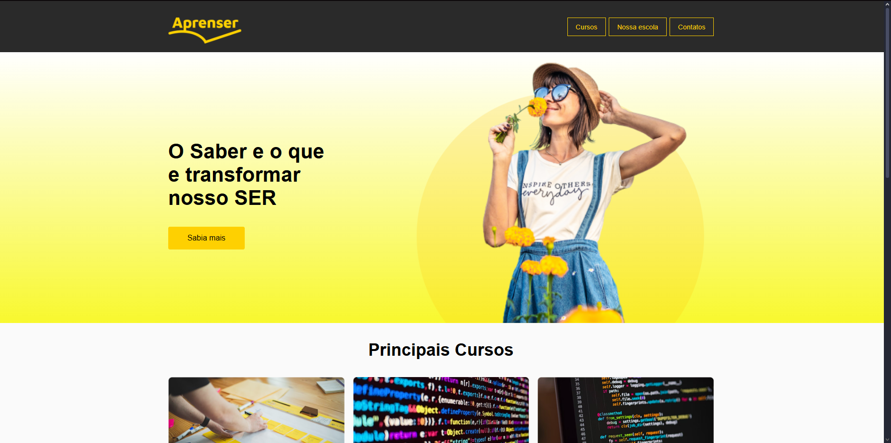
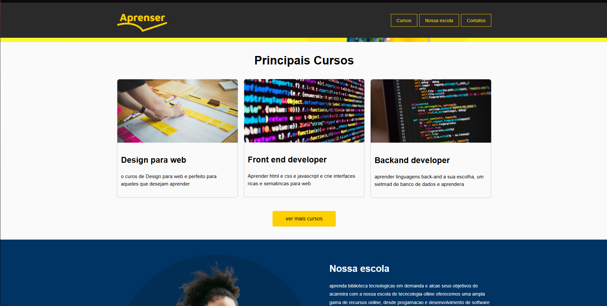
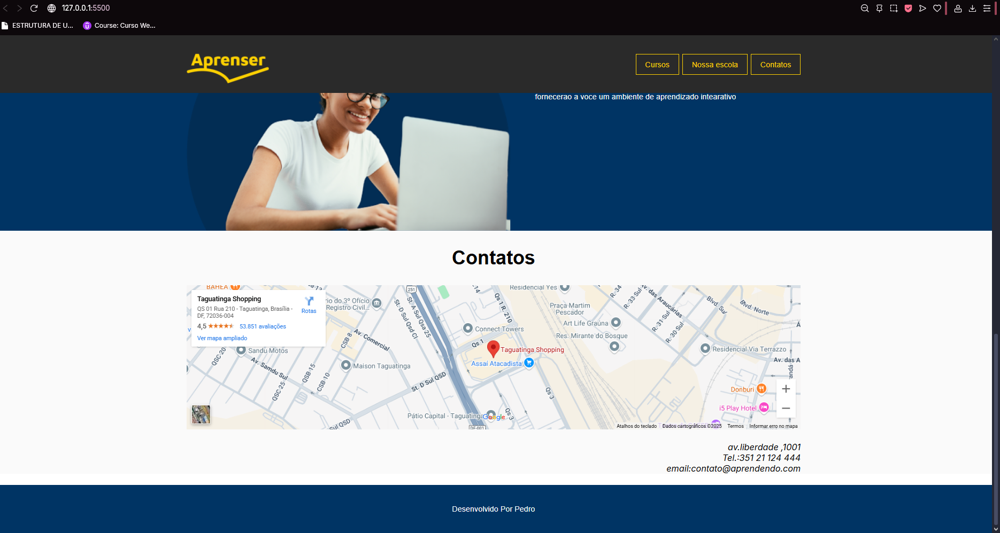

# Projeto Aprenser - Plataforma de Cursos Online (Frontend)

## Visão Geral

O Aprenser é um projeto de frontend que simula a página inicial de uma plataforma de cursos online. O objetivo é apresentar a marca, destacar os principais cursos oferecidos, fornecer informações sobre a escola e disponibilizar formas de contato. O design é limpo, moderno e focado na experiência do usuário, incentivando a descoberta dos cursos.

## Screenshots

**Página Inicial (Topo):**

*Mostra o logo, menu de navegação, slogan principal "O Saber é o que transforma nosso SER" e um botão "Saiba mais".*

**Seção de Principais Cursos:**

*Apresenta os cursos em formato de cards, como "Design para web", "Front end developer" e "Backend developer", com um botão "ver mais cursos".*

**Seção "Nossa Escola" e Contatos:**

*Inclui uma breve descrição da escola, um mapa interativo (Google Maps) e informações de contato (endereço, telefone, email). O rodapé indica "Desenvolvido Por Pedro".*

## Funcionalidades Principais

* **Navegação Intuitiva:** Menu com links para "Cursos", "Nossa escola" e "Contatus".
* **Seção Hero:** Destaque principal com slogan e chamada para ação (CTA).
* **Listagem de Cursos:** Apresentação dos principais cursos em cards com breve descrição.
* **Informações da Escola:** Breve texto sobre a proposta de valor da instituição.
* **Seção de Contato:**
    * Mapa incorporado (Google Maps) para localização.
    * Endereço, telefone e e-mail de contato.
* **Rodapé:** Créditos de desenvolvimento.

## Tecnologias Utilizadas

* **HTML5:** Para a estrutura semântica do conteúdo.
* **CSS3:** Para estilização e layout responsivo (presumido).
* **JavaScript (Potencial):** Embora não explicitamente visível nas funcionalidades estáticas, pode ser utilizado para interações como slideshows, validação de formulários (não presente nas imagens) ou manipulação dinâmica de conteúdo.
* **Google Maps Embed API:** Para a exibição do mapa interativo.

## Estrutura do Projeto (Sugerida)
